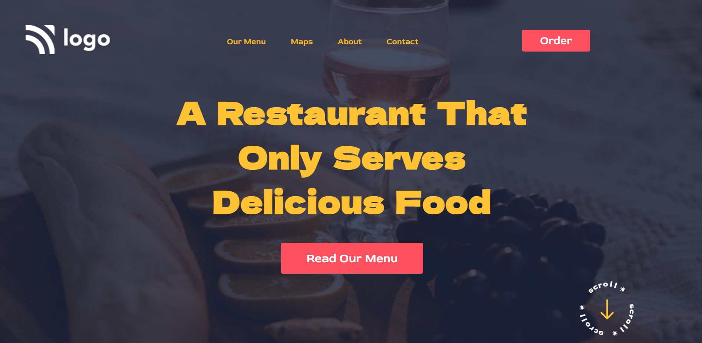

# Restaurant Project

## Description

A Static Restaurant Web page Created using `HTML` and `CSS`.

This project is Hosted on `Netlify`

**Created By :** Yogesh Yadav

## Learing from this Project

- How to use CSS Positioning
- Hoe to use images in Web page with the help of `CSS`
- Use of `linear-gradient()`

__Project Snap Shot__

> Please find the Link of the Project
[__Restaurant__]()

